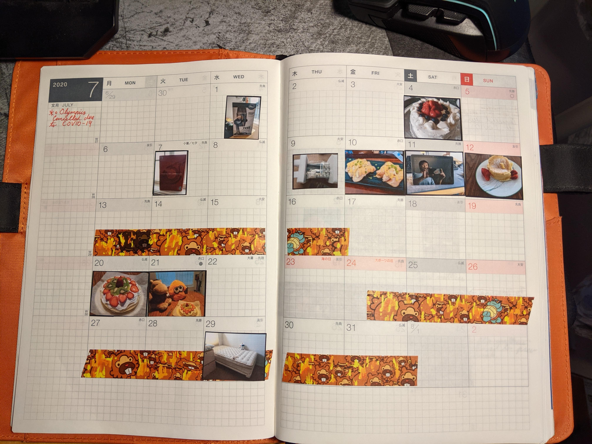

# What is this

See this?

This is the monthly view of my journal back in 2020. See how empty and sad it is? Well, it wasn't (entirely) due to COVID.

So one day I thought to myself, I'm not an artist nor a social media addict, but I do take photos on occasion, whether it is of cute critters in the Lental Region or of a parfait I just had at a cafe, so how about I slap some on this calendar page. Then OCD immediately kicked in and demanded that I need to shrink the photo to match the calendar size so I know which day it was taken. Of course, shrinking photos manually was fun for the first ten seconds and quickly becomes a chore if I have to do it for 30 photos and so I decided to automate the entire process. That's how this project was born.

Essentially this project is a python script where you give it a directory of photos and it will shrink them to the appropriate thumbnail of your choosing and then combines all the thumbnails into one image that you can then print on a 8.5"X11" paper. You can then print them out, cut them out and use them for whatever. It is kind of like [1 Second Everyday](https://1se.co/) (but for journals and people who can't draw) or a sticker booth (but without the mall and friends).

After printing out a final image and cutting the thumbnails out, this is what my journals look like (more or less):

# Requirements:

- Note that virtual environment is heavily suggested
- Python3 (tested with python 3.9.7)
- autopep8 1.5.7
- Pillow 8.4.0
- pycodestyl 2.8.0
- PyYAML 6.0
- toml 0.10.2

- Photos that you want to turn into thumbnails. Preferably in a separate directory.
- A photo printer (alternatively, go to a photo printing service)

# How to Use

- Check out a copy of this repository
- open up a command prompt with either powershell (windows) or bash (Mac, Linux)
- execute the hobonichi calendar script via "python hobonichi_calendar.py"
- when prompted to, copy and paste the directory path to the photos (ie /Users/Alex/Photos/ or C:\Users\Document\Photos\)
- If the work has been completed successfully, a Final_print.jpg will be generated that contains all the thumbnails. You can then print this out on a printer.
